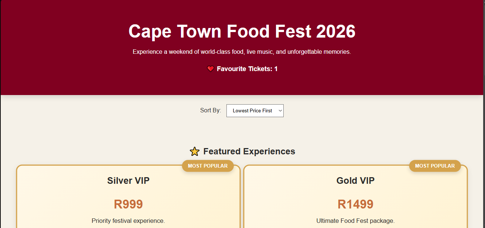

# LCA-Vue-pt 2 Cape Town Food Fest Ticket Landing

**Trainee:** Liam De Wet
<br>
**Programme:** YouthCode Off-Site - Cohort 2, 2026
<br>
**Course:** Course 1 - Frontend Web Development
<br>
**Topic:** Cape Town Food Fest Ticket Landing

<br>

## Overview

A Vue 3 single-page application showcasing ticket tiers for the Cape Town Food Fest.

Features include:

- Dynamic ticket cards
- Featured ticket highlighting
- Favourite ticket functionality
- Responsive design
- Ticket sorting by price

## Technologies

- Vue 3
- Vite
- CSS3

## Installation

```bash
cd week9_ex02_vuejs_food_fest
npm install
npm run dev
```

## Screenshot

<p align="center">
  
</p>
