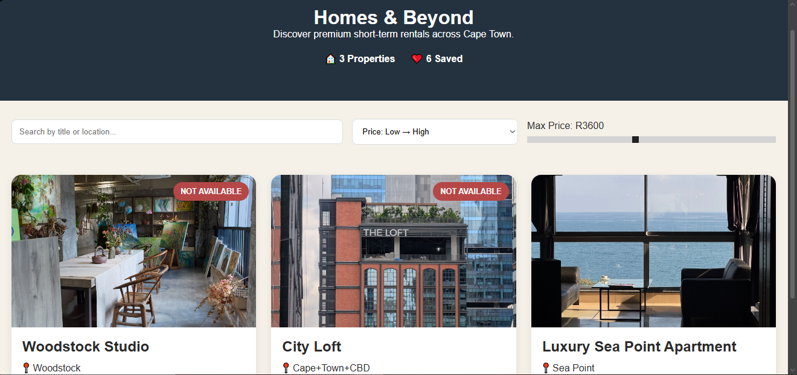

#LCA-Vue-pt 3 Homes & Beyond Property Mini Listings


**Trainee:** Liam De Wet
<br>
**Programme:** YouthCode Off-Site - Cohort 2, 2026
<br>
**Course:** Course 1 - Frontend Web Development
<br>
**Topic:** Cape Town Property listings Landing

<br>

## Overview

A Vue 3 application that showcases short-term rental properties in Cape Town.

### Features

- Dynamic property cards
- Search by title or location
- Sort by price
- Bookmark properties
- Property availability badges
- Responsive layout

## Installation

```bash
npm install
npm run dev
```

## Technologies

- Vue 3
- Vite
- CSS3

## Screenshot

<p align="center">
  
</p>
