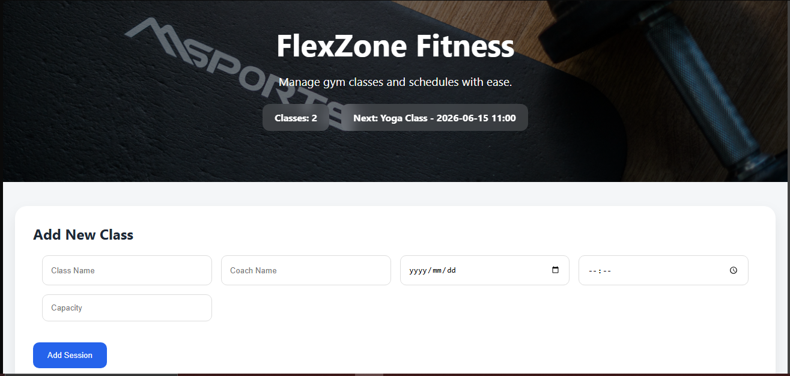

# LCA-Vue-pt 3 FlexZone Fitness Scheduler


**Trainee:** Liam De Wet
<br>
**Programme:** YouthCode Off-Site - Cohort 2, 2026
<br>
**Course:** Course 1 - Frontend Web Development
<br>
**Topic:** Cape Town Food Fest Ticket Landing

<br>

## Overview

A Vue 3 fitness class scheduling application that allows gym staff to create, manage, search, and delete class sessions.

## Features

- Add fitness classes
- Delete classes
- Form validation
- Search by coach
- Session count
- Next upcoming session
- localStorage persistence
- Responsive design
- Animated transitions

## Installation

```bash

cd week9_ex04_vuejs_fitness_scheduler
npm install
npm run dev
```

## Technologies

- Vue 3
- Vite
- CSS3

## Screenshot

<p align="center">
  
</p>
