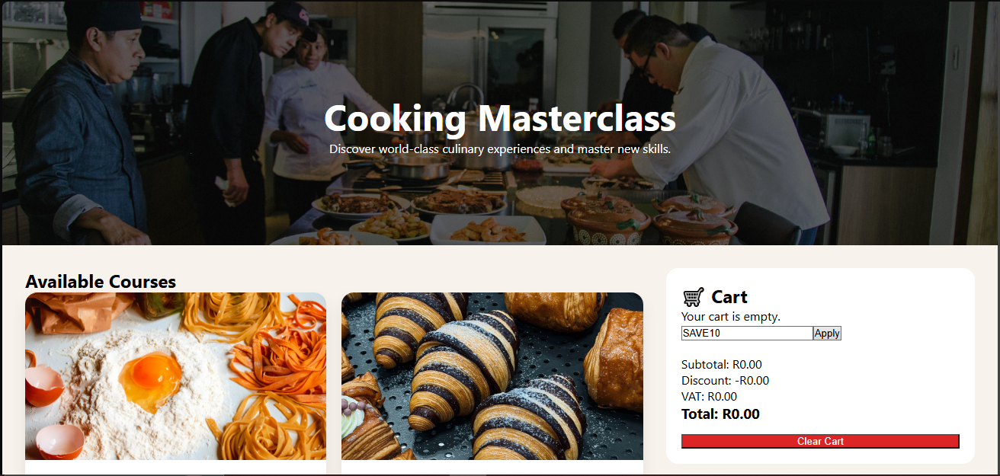

# LCA-Vue-pt 5 Cooking Masterclass Checkout

**Trainee:** Liam De Wet
<br>
**Programme:** YouthCode Off-Site - Cohort 2, 2026
<br>
**Course:** Course 1 - Frontend Web Development
<br>
**Topic:** Cooking Checkout

<br>

## Overview

Cooking Masterclass Checkout is a Vue 3 single-page application that simulates an online course purchasing experience. Users can browse available cooking courses, add them to a shopping cart, adjust quantities, apply discounts, and view a live checkout summary.

The application was built as a prototype for Cooking Masterclass to demonstrate how their future e-commerce platform could function before implementing authentication, payment processing, and backend services.

---

## Features

### Core Features

* Browse cooking courses in a catalogue layout
* View course details and pricing
* Add courses to a shopping cart
* Increase and decrease item quantities
* Remove items from the cart
* Display sold-out courses with disabled purchase buttons
* Live subtotal calculation
* VAT (15%) calculation
* Grand total calculation
* Responsive desktop and mobile layout

### Stretch Goals Implemented

* Coupon code support (`SAVE10`)
* Cart persistence using localStorage
* Animated cart item transitions
* Empty cart message
* Clear Cart functionality

---

## Technologies Used

* Vue 3
* Vite
* JavaScript (ES6)
* HTML5
* CSS3

---

## Installation

### Clone the Repository

```bash
git clone https://github.com/your-username/LCA-VueJS-Exercises.git
```

### Navigate to the Project

```bash
cd week9_ex05_cooking_masterclass_checkout
```

### Install Dependencies

```bash
npm install
```

### Run Development Server

```bash
npm run dev
```

### Build for Production

```bash
npm run build
```

---


---

## Coupon Code

Use the following coupon code during checkout:

```text
SAVE10
```

This applies a 10% discount before VAT is calculated.

---


---

## Screenshot


<p align="center">
  
</p>

